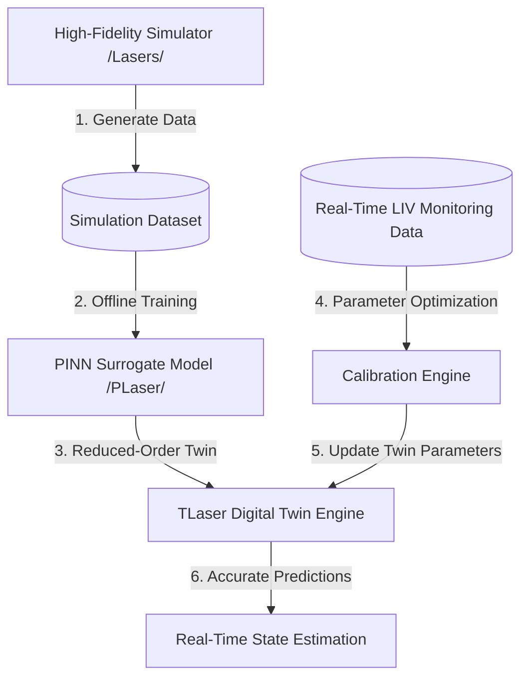

# Project Plan - TLaser: Digital Twin for Telecom Diode Lasers

This plan outlines the architecture, components, and implementation phases for **TLaser**, a digital twin system for telecom diode lasers. TLaser integrates a high-fidelity physical simulator, a real-time Physics-Informed Neural Network (PINN) surrogate model, and an online calibration loop to sync the twin with real-time physical monitoring datasets (L-I-V curves).

---

## Workspace Structure

The project will be housed in the new [`TLaser`](file:///C:/Users/aw4wz/Documents/Codex/TLaser) directory with the following structure:
* [`TLaser/simulator/`](file:///C:/Users/aw4wz/Documents/Codex/TLaser/simulator/): High-fidelity coupled Elmer FEM + FVM physical solver scripts.
* [`TLaser/surrogate/`](file:///C:/Users/aw4wz/Documents/Codex/TLaser/surrogate/): PyTorch model, training scripts, and loss functions for the PINN surrogate.
* [`TLaser/calibration/`](file:///C:/Users/aw4wz/Documents/Codex/TLaser/calibration/): Optimization scripts to calibrate physical parameters using monitoring datasets.
* [`TLaser/data/`](file:///C:/Users/aw4wz/Documents/Codex/TLaser/data/): Storage for simulation sweeps, trained model weights, and calibration inputs.

---

## Proposed Changes

### Phase 1: High-Fidelity Dataset Generation (`/simulator/`)
We will copy and configure the coupled multi-physics solver from the [`Lasers`](file:///C:/Users/aw4wz/Documents/Codex/Lasers/Lasers) project to run extensive parameter sweeps.

#### 1. [NEW] [quasi_3d_synthesizer.py](file:///C:/Users/aw4wz/Documents/Codex/TLaser/simulator/quasi_3d_synthesizer.py)
* Port the 1D cavity shooting-method solver which incorporates 2D transverse parameters from Elmer.
* Support native input arguments for geometries ($w_{\text{active}}$, $d_{\text{active}}$), reflectivities ($R_1$, $R_2$), cavity length ($L$), ambient temperature ($T_0$), and current ($I_{\text{active}}$).

#### 2. [NEW] [generate_dataset.py](file:///C:/Users/aw4wz/Documents/Codex/TLaser/simulator/generate_dataset.py)
* Write a script to automatically run a Latin Hypercube Sweep (or uniform random sweep) over the 7D design parameter space:
  * $R_1 \in [0.1, 0.95]$
  * $R_2 \in [0.05, 0.5]$
  * $L_{\text{um}} \in [100, 1000]\,\mu\text{m}$
  * $T_0 \in [250, 360]\,\text{K}$
  * $I_{\text{active}} \in [0.01, 0.5]\,\text{A}$
  * $w_{\text{active}} \in [1.5, 4.0]\,\mu\text{m}$
  * $d_{\text{active}} \in [0.1, 0.5]\,\mu\text{m}$
* Save generated vectors to [`TLaser/data/pinn_inputs.npy`](file:///C:/Users/aw4wz/Documents/Codex/TLaser/data/pinn_inputs.npy) and [`TLaser/data/pinn_targets.npy`](file:///C:/Users/aw4wz/Documents/Codex/TLaser/data/pinn_targets.npy).

---

### Phase 2: Physics-Informed Neural Network (PINN) (`/surrogate/`)
We will create a PyTorch PINN architecture that enforces physical continuity constraints on the predicted carrier density $N(z)$ and optical power $P(z)$ profiles.

#### 3. [NEW] [model.py](file:///C:/Users/aw4wz/Documents/Codex/TLaser/surrogate/model.py)
* Define the multi-layer perceptron neural network `PINNLaser` mapping 7 inputs to 105 outputs (scalar metrics + 51-point $N$ profile + 51-point $P$ profile).

#### 4. [NEW] [train.py](file:///C:/Users/aw4wz/Documents/Codex/TLaser/surrogate/train.py)
* Implement the custom training loop with combined loss:
  $$\mathcal{L}_{\text{total}} = \mathcal{L}_{\text{data}} + \lambda_1 \mathcal{L}_{\text{carrier\_residual}} + \lambda_2 \mathcal{L}_{\text{photon\_residual}}$$
  * **Carrier Residual Loss:** Enforces the rate equation conservation $G_{\text{inj}} - R_{\text{rec}}(N(z)) - R_{\text{stim}}(N(z), P_{\text{tot}}(z)) = 0$ along the 51 grid points.
  * **Photon Residual Loss:** Enforces the optical propagation equations $\frac{dP^{\pm}}{dz} = \pm (g(N) - \alpha_i) P^{\pm}$ along the cavity.
* Apply `scipy.signal.savgol_filter` on predictions to ensure maximum physical smoothness.
* Save the trained weights to [`TLaser/data/pinn_laser_model.pt`](file:///C:/Users/aw4wz/Documents/Codex/TLaser/data/pinn_laser_model.pt).

---

### Phase 3: Calibration Loop with Real-Time Monitoring (`/calibration/`)
To make it a true digital twin, the system must calibrate its unmeasurable internal parameters using real-time terminal measurements.

#### 5. [NEW] [calibrate.py](file:///C:/Users/aw4wz/Documents/Codex/TLaser/calibration/calibrate.py)
* Implement a calibration optimizer using `scipy.optimize.minimize` (L-BFGS-B or SLSQP) or a least-squares curve-fitting algorithm.
* **Inputs:** Real-time monitored L-I-V (Light-Current-Voltage) curves at different heatsink temperatures.
* **Optimization Parameters:** Fit unknown/drifted physical properties:
  * Internal optical loss $\alpha_i$ (impacts threshold and slope efficiency).
  * Confinement factor $\Gamma$ (impacts gain coupling).
  * Auger recombination coefficient $C$ (impacts thermal droop at high currents).
  * Series resistance $R_s$ and shunt resistance $R_{\text{sh}}$ (impacts the terminal voltage $V(I)$ curve).
* **Objective Function:** Minimize the mean squared error between the twin's predicted L-I-V outputs and the monitored dataset.
* **Outputs:** A calibrated set of physical constants saved to [`TLaser/data/calibrated_params.json`](file:///C:/Users/aw4wz/Documents/Codex/TLaser/data/calibrated_params.json) that aligns the digital twin with the physical laser.

---

## Verification Plan

### Automated Verification
* **Data Gen Test:** Run `generate_dataset.py` to generate a mini test sweep (e.g. 50 samples) and verify inputs and targets save correctly.
* **Model Training Test:** Run `train.py` for 5 epochs to verify that both data loss and physical residual losses compute and converge.
* **Calibration Test:** Create a mock monitoring dataset (with simulated noise) and run `calibrate.py` to verify that the optimizer successfully retrieves the correct parameters.
